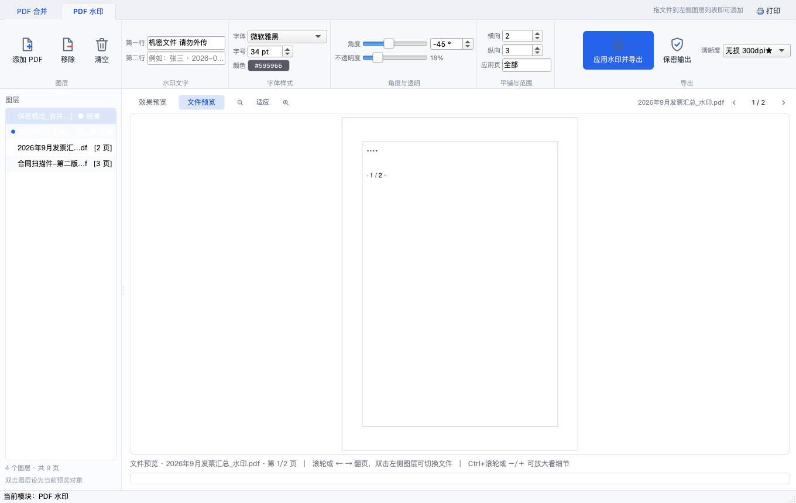
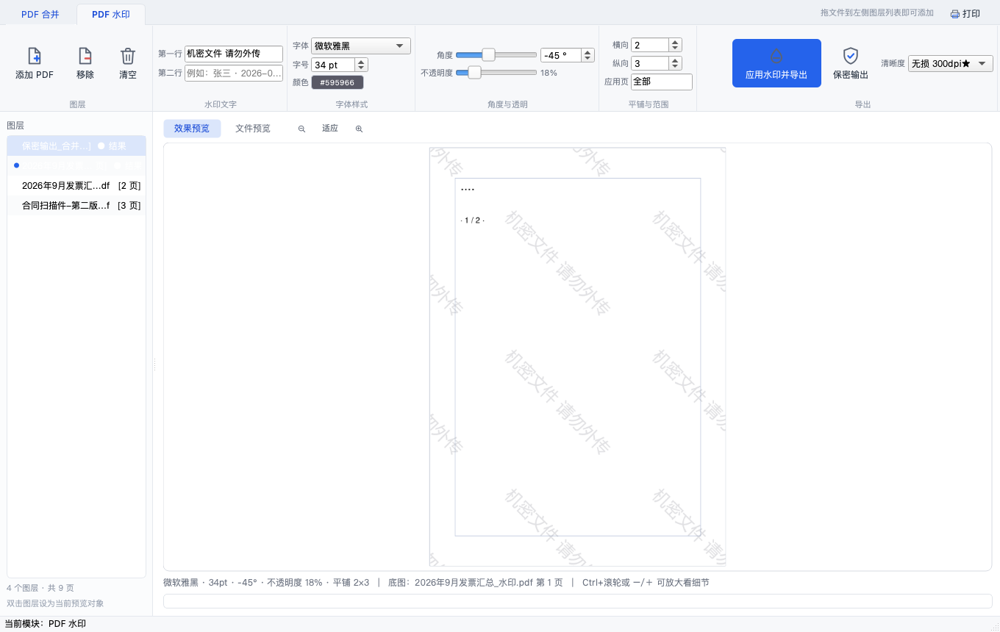
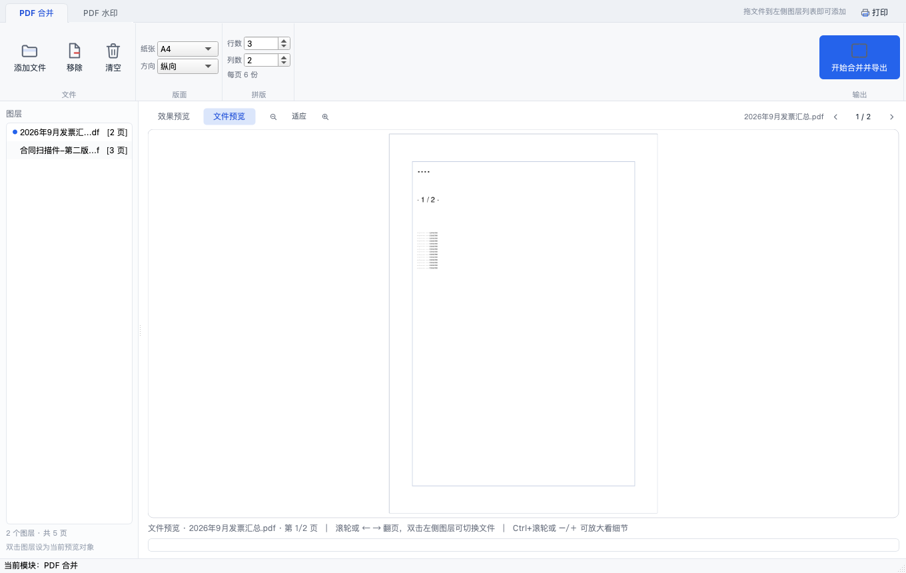
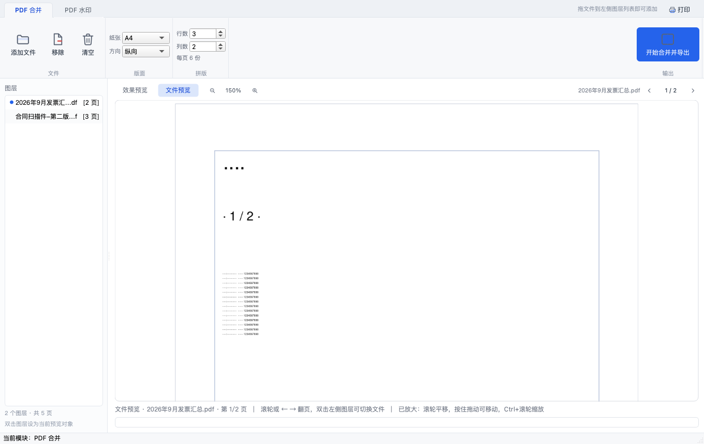
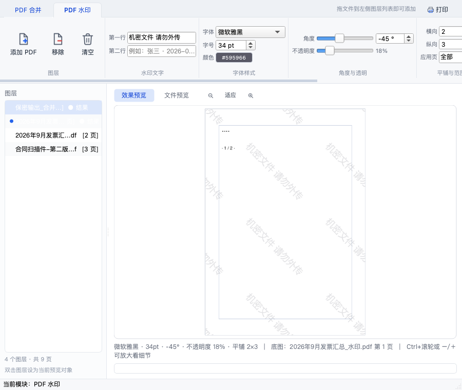
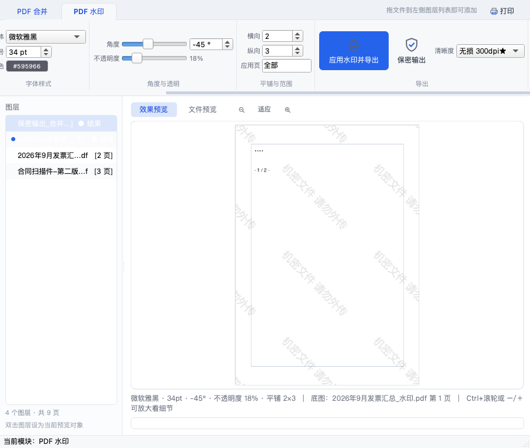
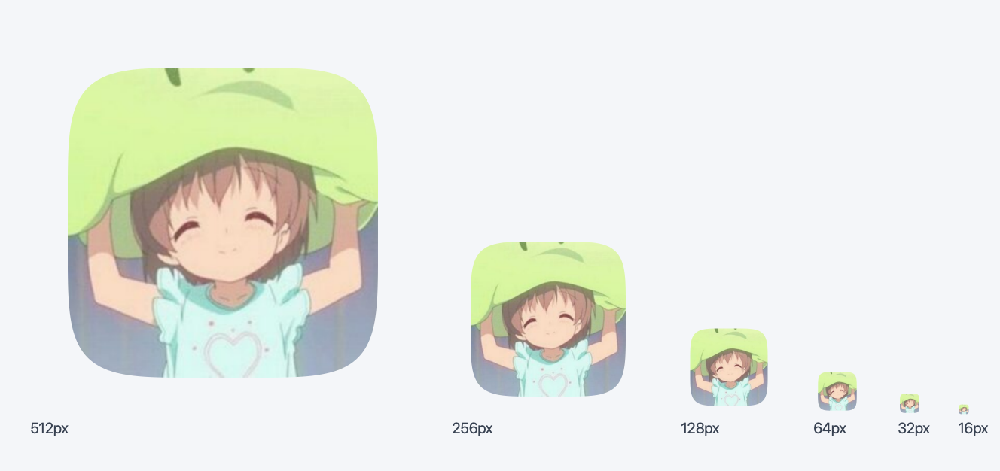

<div align="center">


# PDF 工具箱

**PDF Invoice Merger Tool**

把多份发票 PDF / 图片按「行 × 列」拼版到一页 A4 上，加水印，需要时再抹掉文本层做保密输出。<br>
macOS 原生桌面应用，Ribbon 界面，全部处理在本机完成，不联网、不上传。


</div>

---



## 目录

- [这是什么](#这是什么)
- [下载安装](#下载安装)
- [三步上手](#三步上手)
- [功能详解](#功能详解)
  - [1. PDF 合并（N-up 拼版）](#1-pdf-合并n-up-拼版)
  - [2. PDF 水印](#2-pdf-水印)
  - [3. 保密输出](#3-保密输出)
  - [4. 图层式文件管理](#4-图层式文件管理)
  - [5. 打印](#5-打印)
- [界面预览](#界面预览)
- [从源码运行](#从源码运行)
- [从源码打包](#从源码打包)
- [项目结构](#项目结构)
- [测试](#测试)
- [技术要点](#技术要点)
- [常见问题](#常见问题)
- [版本信息](#版本信息)
- [许可证](#许可证)

---

## 这是什么

一个 macOS 桌面小工具，解决一件具体的事：**报销时把一堆发票 PDF 拼到一页纸上打印**。

手工做法是把每个 PDF 打开、截图、拖进 Word 排版 —— 十张发票要半小时，还容易串页。
这个工具把整件事收成「拖进来 → 选 2×2 → 点合并」，输出一份已排版好的 PDF。

除了拼版，还顺手做了三件相邻的事：**加水印**、**保密输出**（把 PDF 变成不可复制的图片版）、
**打印**。四项能力共用一个「图层」式的文件列表，处理结果自动叠进来，可以接着往下处理。

**适用的内容类型**：发票、报销单、凭证、合同扫描件、票据照片。
**不适用的**：需要保留可搜索文本层的归档场景（那应该用带 OCR 的方案，而不是本工具）。

## 下载安装

从 [Releases](https://github.com/liyu253178/pdf-merger-macos/releases/tag/v3.0.0) 页面下载：

| | |
|---|---|
| **下载** | [`PDF-Toolbox-v3.0.0-macOS-arm64.zip`](https://github.com/liyu253178/pdf-merger-macos/releases/download/v3.0.0/PDF-Toolbox-v3.0.0-macOS-arm64.zip)（42.8 MB，Release 资产） |
| **安装** | 解压，把 `PDF 工具箱.app` 拖进「应用程序」文件夹 |
| **要求** | macOS 11 Big Sur 或更高，Apple Silicon（M 系列）芯片 |
| **SHA-256** | `9bac1fb95373e12d6f5ca150eb5bc2382950fb6e688469c569c098a36dbccf6c` |

> **首次打开被拦下？** 这个包没有 Apple 开发者签名，macOS 会提示「无法验证开发者」。
> 在「访达」里**右键点击 App → 打开**，再在弹窗里点一次「打开」即可，之后就不再询问。
> 若仍被拦，到「系统设置 → 隐私与安全性」页面底部点「仍要打开」。
>
> 也可以先核对校验值，确认下载完整：
> ```bash
> shasum -a 256 PDF-Toolbox-v3.0.0-macOS-arm64.zip
> ```

## 三步上手

1. **添加文件** —— 点功能带的「添加 PDF」，可多选 PDF / JPG / PNG。文件按顺序出现在左侧图层栏。
2. **选版面** —— 「纸张」选 A4 / A3 / Letter，「行数」「列数」决定一张纸放几份（发票常用 2×2）。
3. **合并并导出** —— 点最右侧「开始合并并导出」，选输出位置。结果会作为新图层出现在列表顶部。

右侧预览区可以随时确认效果：**「效果预览」**看当前参数渲染出来的样子，
**「文件预览」**原样翻看某个 PDF 的页面。

## 功能详解

### 1. PDF 合并（N-up 拼版）

把 N 份文档缩放拼到一张纸上，行列可调。核心规则：

- **每个 PDF 逐页展开**，多页文件不会静默丢页 —— 一个 3 页的 PDF 占 3 个格子。
  这一条是刻意避开的坑：参考过的若干同类工具只取第 1 页且不报错。
- **按内容自适应缩放**，等比放入各自的格子，不拉伸变形。
- **行序按阅读顺序**（左上 → 右下）。
- 图片文件（JPG / PNG / TIF / BMP）由 PyMuPDF 原生读取并转换，**不依赖 Pillow**。

### 2. PDF 水印

- **多行文字**，每行独立；角度可调，默认 **-45°**。
- 字号、颜色、透明度、密度可调。
- 字体默认 **微软雅黑**，若本机没装则按 苹方 → 冬青黑体 → 华文黑体 → 内置 CJK 字体 依次回退，
  界面上会为每个候选字体标注**实测的嵌入体积**（下详）。
- 预览以**真实文件为底**，所见即所得。

### 3. 保密输出

固定三步：**先加水印 → 把每一页拆成图片 → 按原顺序合回一个新 PDF**。

成品里只剩像素，因此对外发送时对方**既不能选中复制，也提取不到表单与批注**。

- 原始文件**不被改动**；中间产物落在临时目录，成功或失败都会清理干净。
- 成品**不含**文本层、注释对象、表单域、超链接与文档元信息。
- 页数、顺序、页面尺寸与原文件一致（旋转页的 `/Rotate` 会烘焙进像素，可见长宽比逐像素相同）。
- 代价要说清楚：文字变成图片后**不再可搜索**，体积也会明显变大。

#### 清晰度四档

「够不够清晰」取决于内容，不取决于一个统一的 dpi 数字。典型例子就是本工具的主场景：
4 张 A4 发票 2×2 拼到一页 A4 上，正文字号只剩 **3.3 pt** ——

| 渲染分辨率 | 3.3 pt 文字的像素高度 |
|---|---|
| 200 dpi | 9 px（笔画糊在一起） |
| 300 dpi | 14 px（清晰可读） |
| 400 dpi | 18 px |

所以档位给的是带语义的选项，而不是让用户去猜 dpi：

| 档位 | 分辨率 | 图片格式 | 适用场景 |
|---|---|---|---|
| 标准 | 200 dpi | JPEG q92 | 只看个大概，体积最小 |
| 高清 | 300 dpi | JPEG q92 | 照片、彩色扫描件 |
| **无损 ★** | 300 dpi | **PNG** | 文字、线条、印章（**默认**） |
| 超清 | 400 dpi | JPEG q92 | 需要再放大看细节 |

**默认是「无损」而不是「高清」**，因为对文字线条类内容来说 PNG 不只是更准，而且**更小** ——
实测同一页发票拼版，300 dpi 下 PNG 715 KB、JPEG 999 KB。JPEG 是给照片用的，不是给表格用的。

代价是照片型页面（整页照片、彩色扫描）走 PNG 会到十几 MB 一页，所以加了一道兜底：
**单页 PNG 超过 4 MB 就判定为照片型，这一页单独退回 JPEG**，其余页仍保持无损。
完成提示里会说明有几页发生了回退，不静默改变行为。

### 4. 图层式文件管理

参考 GIS 软件的图层面板思路，左侧窄栏把源文件与处理结果统一当图层管理：

- **结果自动成为新图层**。每次合并 / 加水印 / 保密输出完成后，产出的 PDF 插入到列表**最上方**
  并立即加载为当前预览对象；原有条目**保留不动**，不被覆盖也不被删除。结果图层带 `● 结果` 标记。
- **双击任一图层 = 把它设为当前预览对象**，预览区实时刷新，方便多个 PDF 之间快速比对。
- **图层顺序就是合并顺序**。结果置顶意味着它也会参与下一次合并 —— 这正是「拼完再加水印」能串起来的原因；
  不需要时用「移除 / 清空」。

### 5. 打印

顶部工具条右侧的「打印」作用于**当前模块**的预览对象，优先级为
当前预览对象 → 列表选中项 → 首个 PDF 图层（鼠标悬停即可看到具体是哪个文件）。

点击后先弹**系统标准打印对话框**（打印机 / 页码范围 / 份数），确认才输出：
页码区间由对话框控制，份数交给系统（CUPS）处理，程序只负责把页面按可打印区域等比居中绘制上去，
光栅化分辨率封顶 300 dpi。任务进行中或没有可打印图层时按钮自动禁用。

## 界面预览

**两种预览模式**：左边是「文件预览」（原样看 PDF），右边是「效果预览」（看参数渲染结果）。
改任何一个参数会自动切回效果预览，免得以为「调了没反应」。

| 文件预览 + 图层列表 | 效果预览 |
| --- | --- |
|  |  |

**预览清晰度**是这类工具的痛点：4 合 1 之后正文字号只剩 3.3 pt，按 72 dpi 渲染到屏幕上只有 3 个像素，
怎么显示都是糊的。本工具的渲染倍率跟随显示走 —— 渲染倍率 = 当前缩放 × 屏幕缩放比（Retina 为 2）× 1.35 超采样，
上限约 432 dpi。需要看细节时点 `＋`：

| 适应窗口（看全貌） | 放大 150%（看细节） |
| --- | --- |
|  |  |

**窗口收窄也不散架**。功能带完整排开约需 1300 px，窗口比它窄时整体横向滚动，
而不是把按钮压成 `应用…导出` 这种半截省略号：

| 窄窗口（滚动条出现） | 滚到最右的导出区 |
| --- | --- |
|  |  |

## 从源码运行

要求 **macOS 11+、Python 3.9+**。

```bash
git clone https://github.com/liyu253178/pdf-merger-macos.git
cd pdf-merger-macos
python3 -m venv .venv && source .venv/bin/activate
pip install -r requirements.txt
python main.py
```

以源码方式运行时，窗口图标会退回读取 `assets/icon-1024.png`，开发时也不会看到通用占位图标。

## 从源码打包

体积是这个项目的硬指标。以下是本机（Apple Silicon / macOS 26 / Python 3.9）的**实测结果**：

```text
py2app 打包后      1197.3 MB
build_thin 瘦身后   117.6 MB    ← 减少 90%
  ├ 按白名单裁 PySide6 模块 + 二进制切片
  └ 自检 12 项全过
发布压缩包           43.4 MB
```

### 第一步：用干净的虚拟环境构建（最关键）

**py2app 会把当前 Python 环境里可达的包统统收进 App。**
实测在一个被其它项目污染的共享 venv 里构建时，pandas、geopandas、numpy、matplotlib、fontTools
全部被打包进去，凭空多出 **200 MB 以上** —— 而它们和 PDF 毫无关系。
这往往是体积失控的头号原因，比任何编译选项影响都大。

```bash
python3 -m venv .venv-build
./.venv-build/bin/pip install PySide6-Essentials pymupdf py2app "setuptools==75.8.0"
```

两个环境注意事项：

- **`setuptools==75.8.0` 是必要的**。更新版本移除了 `spawn()` 的 `verbose` 参数，
  py2app 0.28 会报 `TypeError: Popen.__init__() got an unexpected keyword argument 'verbose'`。
- **Python 必须是 framework 构建**。py2app 依赖 `zlib.__file__`，而静态构建的 Python 把 zlib
  编进了内置模块（可用 `'zlib' in sys.builtin_module_names` 判断），会直接报
  `AttributeError: module 'zlib' has no attribute '__file__'`。官方 python.org 安装包、Homebrew
  以及 macOS 自带的 `/usr/bin/python3` 都是 framework 构建，可以放心使用。

### 第二步：打包 + 瘦身

```bash
./.venv-build/bin/python setup.py py2app -b /tmp/pdfbuild -d /tmp/pdfdist
./.venv-build/bin/python build_thin.py --app "/tmp/pdfdist/PDF 工具箱.app"
```

> 加 `-b` / `-d` 把构建中间产物放到项目外，可避免污染工作目录，
> 也能绕开某些环境下对批量删除的保护机制。

`build_thin.py` 做四件事：

1. **清理冗余 Qt 资源与未使用的 PySide6 模块**（体积的大头：`1197 MB → 118 MB`）
2. **二进制切片**：PySide6 的 macOS wheel 是 universal2，含 x86_64 + arm64 两套机器码。
   只发行 Apple Silicon 时切掉 x86_64，实测每个文件省约 49–52%
   （QtWidgets 17.1→8.7 MB，QtGui 12.7→6.4 MB，QtCore 11.1→5.6 MB）。
3. **自检**：调用 `main.py --selftest` 确认瘦身后仍能正常导入、渲染、导出。
   只比体积不验证，很容易交付一个「很小但打不开」的 App。
4. **体积守卫**：瘦身后超过 `SIZE_GUARD_MB`（默认 200 MB）就告警，
   并列出 `PySide6` / `PySide6/Qt` / `PySide6/Qt/qml` / `pymupdf` 各自的体积。
   只告警、不失败 —— 体积受 PySide6 版本影响，偶尔变大不见得是错的，但要让它出现在构建日志里。

常用参数：

```bash
python build_thin.py --dry-run      # 只报告会删什么（切片量也实测，不是估算）
python build_thin.py --keep-x86     # 保留双架构（体积翻倍，不推荐）
```

### 为什么必须按顶层模块白名单删

`setup.py` 的 `excludes` 在这里**不起作用**。原因是 py2app 处理 `includes` 里的 `PySide6.QtCore` 时，
会把**整个 PySide6 包目录**整体拷进产物，而不是只拷被 import 到的模块。
PySide6 6.10 把 Qt 模块分成 Essentials 与 Addons 两档，于是 Qt3D / QtWebEngine / QtMultimedia /
QtCharts / QtLocation / QtGraphs / QtPdf … 连同各自的 QML 模块、metatypes 描述和随附的 FFmpeg
动态库全部进了 bundle。实测同一份源码、同一台机器：

| 是否按白名单删 | 原始体积 | 瘦身后 |
|---|---|---|
| 不删（只靠 `setup.py` 的 `excludes`） | 1197 MB | **217 MB** |
| 删（`KEEP_PYSIDE_MODULES`） | 1197 MB | **118 MB** |

白名单的内容就是 `src/` 实际 import 的五个模块
（`QtCore` / `QtGui` / `QtWidgets` / `QtPrintSupport` / `QtSvg`）加上两个 Qt 内部软依赖
（`QtDBus` / `QtNetwork`），合计不到 2 MB。

**用白名单而不是黑名单**：Addons 的模块清单每次 PySide6 升级都可能变，黑名单漏一个只会少省几 MB
且毫无提示；白名单漏了则会在 `--selftest` 里以**导入失败**的形式立刻暴露 ——
「响了比不响好」的失败模式，更适合这种不报错、只变胖的问题。

## 项目结构

```text
pdf-merger-macos/
├── main.py                 入口（含 --selftest）
├── setup.py                py2app 打包配置（含本地化声明与模块排除）
├── build_thin.py           产物瘦身：白名单删模块 + 二进制切片 + 自检 + 体积守卫
├── requirements.txt        运行与构建依赖
├── src/
│   ├── core/               PDF 处理，与界面完全解耦
│   │   ├── fonts.py        中文字体探测（真实渲染校验 + 子集化实测）
│   │   ├── pdf_merger.py   N-up 拼版
│   │   ├── watermark.py    多行水印
│   │   ├── secure_export.py 保密输出（加水印 → 逐页转图 → 合成）+ 画质档位
│   │   └── pdf_io.py       统一落盘（字体子集化）与打开（加密拦截）
│   └── ui/
│       ├── main_window.py  窗口外壳：模块切换、可滚动的功能带、打印入口
│       ├── modules.py      两个模块：功能带 + 图层栏 + 预览 + 打印动作
│       ├── print_pdf.py    打印：系统打印对话框 + 逐页光栅化绘制
│       ├── ribbon.py       Ribbon 控件（按钮最小宽度按文字算）
│       ├── widgets.py      图层列表、预览画布（缩放/平移/按需渲染倍率）
│       ├── icons.py        内联 SVG 图标（零资源文件）
│       ├── theme.py        全局样式表
│       └── workers.py      后台线程与防抖
├── assets/
│   ├── pdftoolkit.icns     应用图标（tools/make_icon.py 生成）
│   ├── icon-1024.png       图标源图 / 源码运行时的窗口图标
│   ├── lproj/              中/英文界面语言声明（决定原生文件面板的语言）
│   └── 界面-*.png           界面截图
├── tests/
│   ├── run_all.sh          一键跑完全部回归
│   ├── test_e2e.py         端到端功能测试（含异常边界）
│   ├── test_layers.py      图层 / 预览 / 打印目标交互测试
│   └── make_shots.py       界面截图（肉眼核对布局）
└── tools/
    └── make_icon.py        从任意方图生成 macOS 应用图标
```

## 测试

一套命令跑完全部回归（**无需真实显示器**，使用 Qt 的 offscreen 平台），当前 **101 项断言 + 12 项自检全部通过**：

```bash
./tests/run_all.sh        # → ALL TESTS PASSED
```

| 测试 | 规模 | 覆盖内容 |
| --- | --- | --- |
| `main.py --selftest` | 12 项 | 核心链路冒烟：界面装配（含图层列表 / 预览模式 / 打印入口）、字体探测、拼版、图层置顶与保留、水印、**预览清晰度与缩放**、**保密输出四档画质**、打印链路、打印设备枚举、**bundle 本地化声明** |
| `tests/test_e2e.py` | 46 项 | 四条主链路的端到端断言 + 异常边界：N-up 拼版内容完整；水印多行/角度/字体子集化；**保密输出**的页数·顺序·尺寸保持、文本层/注释/超链接/元信息清除、临时目录清理、**四档画质的格式与体积走向、照片页自动回退 JPEG**、旋转页尺寸不颠倒；损坏文件/缺失文件/加密文件的中文报错；打印链路与页码范围钳制 |
| `tests/test_layers.py` | 55 项 | 交互行为：结果图层自动置顶且原图层保留、双击切换预览对象、翻页边界、移除后回落、空态按钮禁用、打印目标优先级、**预览缩放与渲染倍率联动**、**窄窗口下功能带不被压扁** |

单独跑某一项：

```bash
QT_QPA_PLATFORM=offscreen python tests/test_e2e.py     # 端到端
QT_QPA_PLATFORM=offscreen python tests/test_layers.py  # 交互
QT_QPA_PLATFORM=offscreen python main.py --selftest    # 冒烟
```

重新生成界面截图（输出到 `$TMPDIR/pdftk-shots`）：

```bash
QT_QPA_PLATFORM=offscreen python tests/make_shots.py
```

> 自检必须调用**以 App 名命名的启动器**。py2app 的 `Contents/MacOS/` 下还有一个辅助用的
> `python` 可执行文件，它带着不同的动态库路径，直接跑它会报
> `Library not loaded: @executable_path/../../../../Python3` —— 那是假阴性，不代表 App 有问题。

## 技术要点

### 预览清晰度：渲染跟着显示走

预览一度写死 72 dpi 渲染 —— A4 只有 595 px 宽，3.3 pt 的小字落到画布上只剩 3 个像素。
现在分两层解决：

- **渲染跟着显示走**：渲染倍率 = 当前缩放 × 屏幕缩放比（Retina 为 2）× 1.35 超采样，上限约 432 dpi。
  判据是「渲染出的像素不少于屏幕上真正需要的像素」，不做无谓的放大插值。
- **需要细节就放大**：`− 适应 ＋`，`Ctrl+滚轮` 或 `+` `-` 连续缩放，`0` 回适应；
  放大到超出画布后按住拖动平移。缩放以 100% = 1pt 对应 1 逻辑像素为基准，与常见 PDF 阅读器一致。
- 渲染在后台线程做，缩放/改参数/窗口尺寸变化都走 260 ms 防抖；倍率变化小于 18% 不重算，
  拖窗口不会把界面拖卡。

### 中文字体：必须做双重校验

macOS 的中文字体多为 `.ttc` 字体集合，有三个隐蔽的坑：

1. **必须同时传 `fontfile` 和 `fontname`**。只传 `fontfile` 会静默回退到 Helvetica，
   中文全部消失且**不报任何错**。
2. **必须实测子集化效果**。部分 `.ttc`（如冬青黑体）无法被有效子集化，
   会把整份 18 MB 字体塞进 PDF。
3. **必须用 TextWriter 探测**。宋体 `Songti.ttc` 在 `insert_text` 下正常，走 `TextWriter`
   却抛 `FzErrorUnsupported`。用错路径探测会在运行时才崩。

所以 `src/core/fonts.py` 用**真实渲染路径**逐个试跑，并实测子集化后的体积，不达标的字体直接排除。

### 界面语言：文件面板为什么是英文

「添加 PDF」弹出的文件选择窗口**由 macOS 的 AppKit 绘制**（`NSOpenPanel`，Qt 在 macOS 上默认走原生面板）。
它的语言**不取决于系统语言设置，而取决于 App bundle 声明的支持语言** —— 这是最容易踩空的一点。

py2app 默认只写 `CFBundleDevelopmentRegion = English`，既没有 `CFBundleLocalizations` 也没有任何
`.lproj`。macOS 于是判定这个 App **只支持英文**，连带把 AppKit 自己的界面（打开/保存面板、
面板上的按钮与侧栏）也切成英文。表现就是：应用主界面是中文，一点「添加 PDF」弹出全英文的文件夹窗口。

> Qt 自带的翻译包在这里**帮不上忙**。`qt_zh_CN.qm` 只管 Qt 自己绘制的控件；
> 走原生面板时，这些字符串根本不经过 Qt。

修法是在 `setup.py` 的 `plist` 里补齐两处声明，并放上真实的 `.lproj` 目录：

```python
"CFBundleDevelopmentRegion": "zh_CN",          # 匹配不上时回退到中文
"CFBundleLocalizations": ["zh-Hans", "zh_CN", "en"],
```

`CFBundleLocalizations` 是权威来源，`.lproj` 目录是传统识别方式，两者都给最稳。
细节：`CFBundleDevelopmentRegion` 用 `zh_CN` 而非 `zh-Hans`（旧系统只认带地区的写法）；
`InfoPlist.strings` 用 **UTF-16LE + BOM** 写（传统格式，各版本都认，直接写 UTF-8 在部分系统上会被静默忽略）；
产品名**不做翻译**，本地化要解决的是系统面板的语言，不是品牌名。

`main.py --selftest` 里有一项专门查这件事。它和图标检查是同一类问题：
**不报错也会丢**，只有肉眼才看得出来，所以必须在构建阶段拦住。

### 应用图标：不是原图直接转 icns

macOS 的应用图标不是方图，而是**圆角方形（squircle）+ 四周透明留白**。
Apple 的图标网格是 1024×1024 画布上放一块 824×824 的圆角方块。
直接把方图丢进 Dock，会显得比旁边的系统图标大一圈、四个直角也很突兀。

```bash
python tools/make_icon.py <任意方图> --out-dir assets --name pdftoolkit
```

圆角用超椭圆 `|x/a|^5 + |y/a|^5 = 1` 采样得到 —— 这是对 Apple 连续圆角的常用逼近，
比普通圆角矩形更接近原版观感；全程开抗锯齿。一次性产出 10 个尺寸（16 → 1024，含全部 `@2x`）。

`build_thin.py` 的验收关卡会**额外检查图标真的进了产物**（既要 `Info.plist` 里有
`CFBundleIconFile`，也要 `Resources/` 下真有那个 `.icns`）—— 图标是「不报错也会丢」的典型。



> 生成图标用的源图是 300×300，而 `.icns` 最大要 1024 —— 大尺寸是由小图插值上来的，
> 在 Dock 的小尺寸下看没问题，放大到 Launchpad / 访达大图标会偏软。
> 想更锐利的话，换一张 1024×1024 的原图重跑上面的命令即可。

## 常见问题

**Q：合并后的小字看不清？**
预览里点 `＋` 放大，或按住 `Ctrl` 滚轮。导出时选「无损」档（默认）而不是「标准」。

**Q：保密输出后文件变得很大？**
这是把页面转成图片的必然代价。想小一点就降到「标准」（200 dpi），
或对照片型内容改用「高清」（JPEG 编码对照片更高效）。

**Q：保密输出后不能搜索文字了？**
这是设计目的。保密输出就是要把文本层抹掉，让内容不可复制、不可检索。
需要保留文本层就别用这个功能，直接合并即可。

**Q：水印字体显示的不是微软雅黑？**
macOS 默认不装微软雅黑，它通常随 Microsoft Office 一起安装。
程序会自动回退到苹方等系统字体，界面上每个候选字体都标了实测嵌入体积。

**Q：双击 App 提示「无法验证开发者」？**
包里没有 Apple 开发者签名。在访达里**右键点 App → 打开**，弹窗里再点一次「打开」即可。

**Q：这个 App 只有 Apple Silicon 版吗？**
当前发布包是 arm64。Intel Mac 需要从源码打包，并用 `build_thin.py --keep-x86`
（或跳过瘦身脚本）保留双架构。

**Q：会把我处理的文件传到网上吗？**
不会。全部处理在本机完成，程序没有联网代码。

## 版本信息

| 项 | 值 |
|---|---|
| 版本 | **3.0.0** |
| Bundle Identifier | `com.local.pdftoolkit` |
| 构建产物 | `PDF 工具箱.app`，115.9 MB，arm64 |
| 发布包 | `PDF-Toolbox-v3.0.0-macOS-arm64.zip`，42.8 MB |
| 自检项 | 12 项全部通过 |
| 依赖 | PySide6-Essentials ≥ 6.6、PyMuPDF ≥ 1.24、py2app ≥ 0.28（仅构建） |

## 许可证

本项目代码采用 **MIT**，见 [LICENSE](LICENSE)。

**但请注意依赖的许可证**：PDF 引擎 [PyMuPDF](https://github.com/pymupdf/PyMuPDF) 采用
**AGPL-3.0**，具有传染性 —— 分发基于它的软件需要一并开源（或购买商业授权）。
若要闭源商业分发，需将 `src/core/` 中的 PDF 操作替换为许可证宽松的实现
（如 [pikepdf](https://github.com/pikepdf/pikepdf)，MPL-2.0），
或使用 [qpdf](https://github.com/qpdf/qpdf)（Apache-2.0）。
